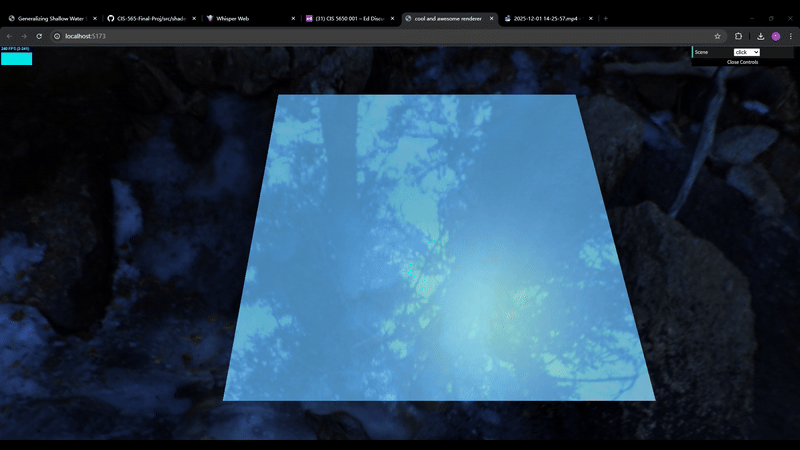
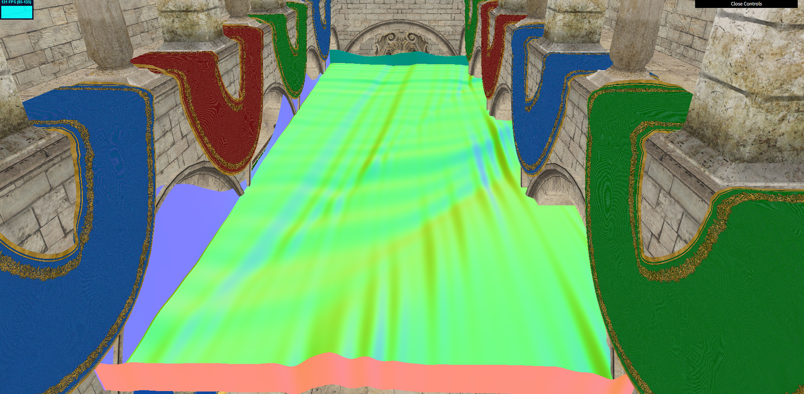

# WebGPU Flowing Shallow Waves

## Overview

Interactive WebGPU demo that mixes shallow-water bulk flow with dispersive surface waves. The app renders a height-displaced water grid with planar reflections and an HDR environment, and exposes multiple “scene” presets to initialize the water differently.

### What it does now
- Real-time water simulation and rendering in WebGPU (planar reflection, Fresnel, depth attenuation).
- Multiple height-map initializations per scene (default, terrain, ship, click) to explore different starting conditions.
- Env map skybox and reflection rendering; water shader blends lighting with reflection.
- Click interaction to inject localized bumps into the height map.
- GUI (dat.gui) to switch scenes; stats.js overlay for FPS.

### How to run
- `npm install`
- `npm run dev` (Vite dev server)
- Open the served URL in a WebGPU-enabled browser (Chrome/Edge Canary with WebGPU on).

### Controls / interaction
- `WASD/QE` move camera, mouse look.
- GUI drop-down: switch scene presets (recreates simulation state).
- Click: inject a bump into the height map (click scene); other scenes use their own seeded patterns.

### Tech highlights
- WebGPU compute pipelines: diffusion/decomposition, shallow water bulk, transport, recombination.
- FFT-based Airy waves pipeline (present, can be toggled in Simulator).
- Planar reflection with a mirrored camera; HDR env map for skybox and reflection.
- Water shader with Fresnel and depth-based attenuation.

### Next steps / ideas
- Re-enable and polish Airy waves + transport stages in the main loop.
- Add shoreline/terrain coupling and boat–water interaction.
- Improve water BRDF (roughness, normal reconstruction) and foam effects.

## Milestone #3

[Presentation](https://docs.google.com/presentation/d/1-pZEL7KyuXHIfY0tvWP7sJcYZtmUHj6yOv1_R-ZO7js/edit?slide=id.g3ac6ef2219f_0_0#slide=id.g3ac6ef2219f_0_0)

### Result so far

### Progress

- Simulation
    - Debugging
- Rendering
    - Env map
    - Fresnel term
- Interaction
    - Basic interaction with click

## Milestone #2

[Presentation](https://docs.google.com/presentation/d/1lJLH3f-Co_1rXHLxbPfNIJFWTP1bZ9lcO_hnZY8Z0Fk/edit?slide=id.p#slide=id.p)

### Result so far

### Progress

- Simulation (Implement the entire algorithm)
    - Decompose step
    - Bulk fluid flow
    - Airy waves
        - Rewrite GPU FFT
    - Transport surface
    - Compute result

## Milestone #1

### Presentation Link

[Presentation](https://docs.google.com/presentation/d/1f0aQoDJ7CiCaOS2odb2qIY7guG_IkVA5Ko-hc2IKO7o/edit?slide=id.p#slide=id.p)

### Progress

- Simulation
    - Implement Simulator class and method functions
    - Divided simulation into 4 steps
    - Implemented decomposition
- Rendering
    - Semi-transparent water rendering with alpha blending
    - Planar reflection on the water surface using a mirrored camera

### Reference

- Stefan Jeschke and Chris Wojtan. 2023. Generalizing Shallow Water Simulations with Dispersive Surface Waves. ACM Trans. Graph. 42, 4, Article 83 (August 2023), 12 pages. https://doi.org/10.1145/3592098
- Stefan Jeschke, Tomáš Skřivan, Matthias Müller-Fischer, Nuttapong Chentanez, Miles Macklin, and Chris Wojtan. 2018. Water surface wavelets. ACM Trans. Graph. 37, 4, Article 94 (August 2018), 13 pages. https://doi.org/10.1145/3197517.3201336

- [Web FFT](https://github.com/IQEngine/WebFFT?tab=readme-ov-file)
