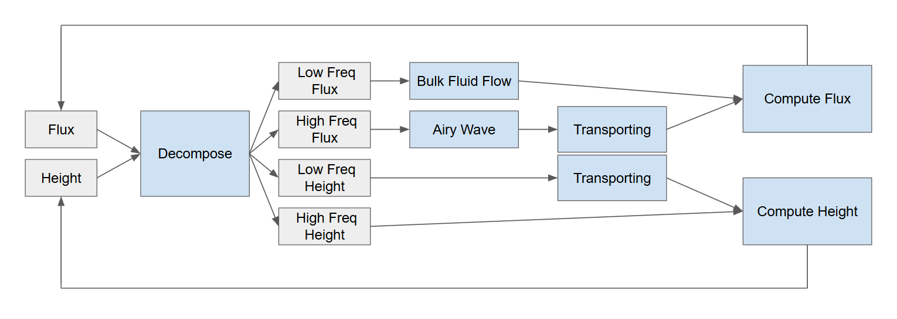
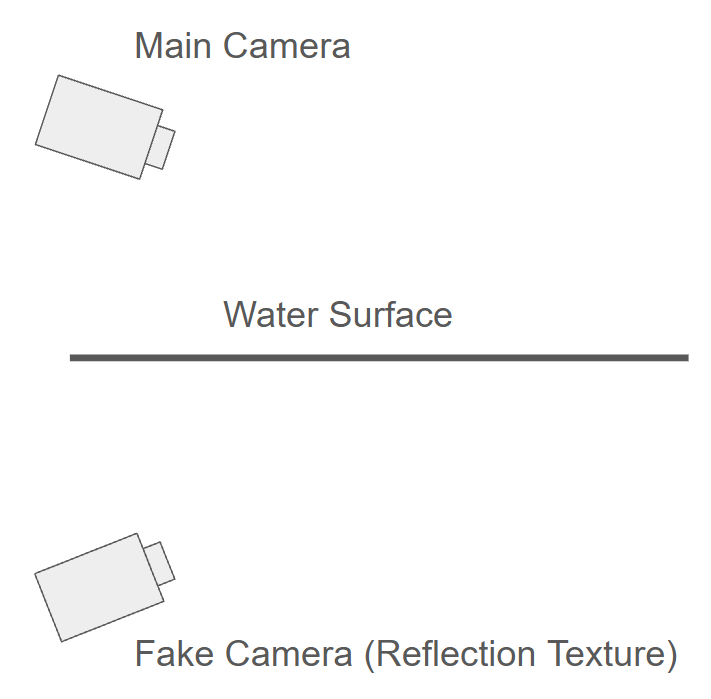
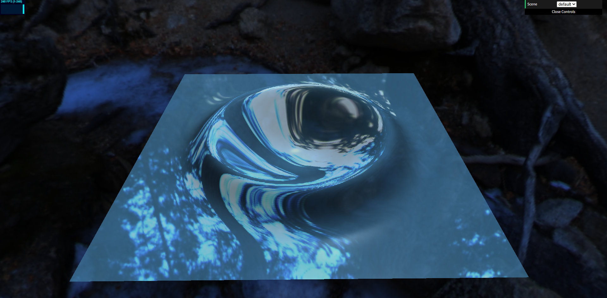

# WebGPU Flowing Shallow Waves

WedGPU Flowing Shallow Waves is a project created by [Qirui Fu](https://github.com/QiruiFU), [Pavel Peev](https://github.com/thesquashedman) and [Tianhong Zhou](https://github.com/TianhongZhou).

## Overview

Real-time shallow-water demo built on WebGPU. We approximate the SIGGRAPH 2023 “Generalizing Shallow Water Simulation with Dispersive Surface Waves” idea with a split low/high-frequency solver so large waves and ripples coexist. The project runs fully in the browser, ships with multiple interactive scenes (default, terrain, ship, click), and layers gameplay-style controls (steer a boat, click to shoot waves) on top of the simulator.

### Shallow Water Simulation

#### Algorithm

We maintain coupled low/high-frequency height and flux fields. Each frame: (1) copy previous state for recombination; (2) diffuse low/high components; (3) update velocities via shallow-water flux; (4) transport high-frequency flux/height; (5) recombine into full height/flux; (6) optional additives (ship wakes, click bumps). All steps run in compute passes on WebGPU. Height/flux use R32F textures and a regular grid; normals come from finite differences in the vertex shader.

#### Simulation examples

The solver remains stable across diverse initializations: flat water, beach/islands, or user-perturbed fields. High-frequency ripples ride on top of slow-moving swells, and clicks or ship wakes propagate without blowing up. Multiple seeds shown below stay coherent over long runs without visible energy gain/loss.

### Interactions

#### Terrain

Terrain scene supports sloped beaches and soft islands. Water follows the generated heightmap while remaining fully interactive (clicks/wakes still propagate). The sloped setup avoids vertical faces to reduce aliasing and preserve stability when waves hit shore.

#### Ships

Arrow keys move the imagined ship on the water plane; a follow camera can be toggled to orbit behind it. NPC boats can be spawned to circle waypoints and emit wakes. The ship model rides a fixed water plane for rendering but its wake is injected into the simulated height field.

#### Create Waves

Default/click scenes: pointer click casts a projectile toward the water plane and injects a localized bump on impact; click scene can also drop waves directly at the cursor. Amplitude/sigma are tunable and stack with ongoing simulation dynamics.

### Rendering

#### Planar Reflection

Reflection pass renders the scene from a mirrored camera into an offscreen texture, then samples it in the water shader. A small Y offset on the reflection plane plus stencil-like discard in the material shader keeps underwater geometry from leaking.

#### Environment Mapping

Skybox is sampled from an equirectangular HDR and bound as an environment map for both the main and reflection cameras. It provides distant lighting cues and feeds the water fresnel term with believable reflections.

#### Shaing

Side-by-side fresnel comparison: with fresnel the water picks up angle-dependent highlights and darker grazing angles; without it the surface looks flat and plastic. Specular term uses the environment map for reflections.

### Controls / interaction
- Scene switcher: GUI dropdown (default/terrain/ship/click).
- Default scene: Arrow keys to move ship, `Z` to toggle follow camera, click to fire a projectile that creates a bump where it lands.
- Click scene: click directly on water to spawn a bump/wave.
- General: orbit/pan via the camera controls in your browser (pointer/drag as implemented by the camera class).

### Next steps / ideas
- Water rendering: foam/whitecaps and shoreline blending; SSR for non-planar content; better BRDF for fresnel/specular.
- Simulation: spray/particle splashes coupled to wave crests; wind-driven waves; adaptive/stabler time stepping.
- Terrain/content: procedural coastline generator; erosion masks for beaches; higher-res adaptive grid LOD.
- Performance/UX: GPU profiling, async compute/graphics overlap; quality/perf toggles; save/load scene presets and camera paths.

### How to run
- `npm install`
- `npm run dev` (Vite dev server)

### Reference

- Stefan Jeschke and Chris Wojtan. 2023. Generalizing Shallow Water Simulations with Dispersive Surface Waves. ACM Trans. Graph. 42, 4, Article 83 (August 2023), 12 pages. https://doi.org/10.1145/3592098
- Stefan Jeschke, Tomáš Skřivan, Matthias Müller-Fischer, Nuttapong Chentanez, Miles Macklin, and Chris Wojtan. 2018. Water surface wavelets. ACM Trans. Graph. 37, 4, Article 94 (August 2018), 13 pages. https://doi.org/10.1145/3197517.3201336

- [Web FFT](https://github.com/IQEngine/WebFFT?tab=readme-ov-file)
